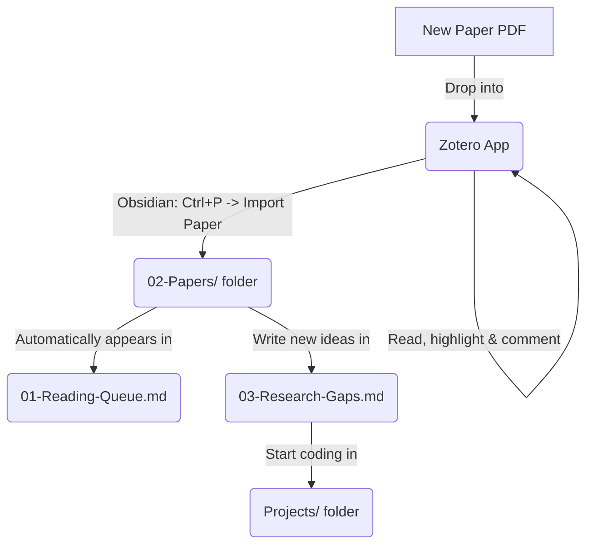

# 🛡️ Academic Research Workflow Template (Obsidian + Zotero)

Welcome! This is a simple and powerful template to help you organize your academic research notes, reading lists, and coding projects in one place.

It connects **Zotero** (for saving and reading PDFs) with **Obsidian** (for taking notes and linking ideas), keeping everything neat and automatic.

---

## ⚡ Quick Start (Setup Guide)

To get this automated system running, you need to install and configure two Obsidian plugins:
1. **Dataview** (to automatically create tables of your papers).
2. **Zotero Integration** (to sync notes and highlights from Zotero).

👉 **[Click here to open the step-by-step Setup Guide](Workflow-Plugins-Setup-Guide.md)** to configure these plugins easily.

---

## 📂 1. Folder Structure Explained Simply

Here is what each folder and file is used for:

* **`README.md`**: This guide.
* **`Workflow-Plugins-Setup-Guide.md`**: Step-by-step instructions to set up the plugins and Git.
* **`00-Templates/`**: Contains pre-made layouts (templates) for paper notes and project overviews.
* **`01-Reading-Queue.md`**: Your dashboard. It automatically lists all the papers you are reading.
* **`02-Papers/`**: The folder where all your individual paper notes are stored.
* **`03-Research-Gaps.md`**: A central page to write down unsolved research questions and ideas.
* **`04-Topics.md`**: A page to map out themes, keywords, and fields of interest.
* **`Projects/`**: The directory for your code and experiments. Each project folder here is kept separate.

---

## 🔄 2. Simple Daily Workflow (How to use it)

Here is the step-by-step process of using this setup:

### Step 2.1: Add & Read in Zotero
1. Drag and drop your paper PDF into Zotero.
2. Double-click the PDF inside Zotero to open it.
3. Highlight important sentences and write notes/comments on the PDF.

### Step 2.2: Sync to Obsidian
1. Open Obsidian. Press **`Ctrl + P`** to open the command search.
2. Type **`Zotero Integration: Import Paper`** and press **Enter**.
3. Type the name of the paper or author, select it, and press **Enter**.
4. Obsidian will automatically create a neat summary file in `02-Papers/` containing all your highlights and comments!

### Step 2.3: Check Your Reading Queue
* Open [01-Reading-Queue.md](01-Reading-Queue.md) and switch to **Reading View** (`Ctrl + E`).
* Your paper will automatically show up in the table, sorted by publication year.

---

## 🚦 3. Paper Reading Status

You can change the reading status of any paper by editing the `status` field in the metadata block at the top of the paper note:

* `status: "❣️todo"` : Unread paper waiting in the queue.
* `status: "📖reading"` : Currently reading.
* `status: "🟢read"` : Completed reading and note taking.

---

## 🐙 4. Git Architecture (Managing Notes & Code Separately)

To prevent errors like "Git inside Git" and keep your personal notes secure, this template uses a **Decoupled Git Architecture**:

1. **Your Research Notes (Vault Root)**:
   * The main folder is a Git repository for your notes, templates, and reading lists.
   * The root `.gitignore` is pre-configured to **ignore the `Projects/` folder**.
   * You can push your notes to a private GitHub repository safely.
2. **Your Coding Projects (`Projects/`)**:
   * Each folder inside `Projects/` (e.g., `Projects/Project1/`) can be an **independent Git repository**.
   * You can initialize Git inside each project folder separately and push the code to a separate public or private GitHub repository.
   * Since the root Git ignores `Projects/`, there will be **no conflicts** or leaked configurations.

